# Diagrama de Clases UML — Sistema TIERRA
**E-commerce de Indumentaria y Alquiler de Equipo de Invierno**
*Documentación técnica del modelo de clases bajo el estándar UML 2.5*

---

## 1. Visión General del Sistema

El sistema **TIERRA** combina dos unidades de negocio complementarias bajo una arquitectura unificada:
1. **E-commerce (Venta Online de Indumentaria y Accesorios)**: Gestión de catálogo con variantes (talla/color), carrito de compras con reserva de stock temporal anti-sobreventa (TTL), cupones, pedidos y envíos. *(Nota de diseño: El stock online está desacoplado a propósito del sistema físico de local comercial "Andino")*.
2. **Alquiler de Equipos de Invierno**: Catálogo de equipos serializados (esquís, tablas de snowboard, botas, cascos), control de tarifas por temporada, reservas por rango de fechas sin solapamiento (garantizado a nivel de base de datos mediante exclusión GiST sobre rangos temporales), entregas, devoluciones y mantenimiento preventivo/correctivo.
3. **Plataforma Transaccional de Pagos**: Pasarela de pagos integrada (Mercado Pago Checkout Pro / Webhooks) que unifica el cobro tanto de órdenes de compra como de reservas de alquiler sin almacenar datos sensibles de tarjetas (cumplimiento PCI-DSS).

---

## 2. Diagrama de Clases de Dominio (Entidades de Negocio)

A continuación se presenta el diagrama de clases conforme a la especificación **UML 2.5**, incluyendo:
- **Visibilidad estándar**: `-` privado, `+` público, `#` protegido.
- **Tipos de datos tipados**: `UUID`, `String`, `BigDecimal`, `LocalDate`, `LocalDateTime`, `Boolean`, `Integer`.
- **Relaciones estándar**:
  - **Composición (`*--`)**: Ciclo de vida dependiente (eliminación en cascada). Ej: `Pedido` a `PedidoItem`, `ReservaAlquiler` a `ReservaItem`, `Carrito` a `CarritoItem`, `Producto` a `VarianteProducto`.
  - **Agregación / Asociación (`-->`)**: Referencias navigables con multiplicidad (`1`, `0..1`, `0..*`, `1..*`).
  - **Auto-asociación / Reflexiva**: `Categoria` con jerarquía de categorías padre.
  - **Restricción XOR**: `Pago` se vincula exclusivamente a un `Pedido` o a una `ReservaAlquiler`.

```mermaid
classDiagram
    direction TB

    %% ==========================================
    %% ENUMERACIONES (Stereotype <<enumeration>>)
    %% ==========================================
    class RolUsuario {
        <<enumeration>>
        CLIENTE
        ADMIN
        STAFF
    }

    class GeneroProducto {
        <<enumeration>>
        HOMBRE
        MUJER
        UNISEX
        NINO
    }

    class EstadoPedido {
        <<enumeration>>
        PENDIENTE
        PAGADO
        PREPARANDO
        ENVIADO
        ENTREGADO
        CANCELADO
    }

    class TipoEntrega {
        <<enumeration>>
        ENVIO_DOMICILIO
        RETIRO_LOCAL
    }

    class MetodoPago {
        <<enumeration>>
        MERCADO_PAGO
        TARJETA_CREDITO
        TARJETA_DEBITO
        EFECTIVO
    }

    class EstadoPago {
        <<enumeration>>
        PENDIENTE
        APROBADO
        RECHAZADO
        REEMBOLSADO
        EXPIRADO
    }

    class EstadoEnvio {
        <<enumeration>>
        PENDIENTE
        EN_CAMINO
        ENTREGADO
        DEVUELTO
    }

    class EstadoReserva {
        <<enumeration>>
        RESERVADO
        ENTREGADO
        DEVUELTO
        CANCELADO
        ATRASADO
    }

    class CondicionEquipo {
        <<enumeration>>
        EXCELENTE
        BUENO
        REGULAR
        FUERA_DE_SERVICIO
    }

    %% ==========================================
    %% MÓDULO 1: USUARIOS Y DIRECCIONES
    %% ==========================================
    class Usuario {
        -UUID id
        -String nombre
        -String email
        -String passwordHash
        -String telefono
        -String dni
        -RolUsuario rol
        -LocalDateTime creadoEn
        +getId() UUID
        +getNombre() String
        +getEmail() String
        +getRol() RolUsuario
        +setRol(RolUsuario rol) void
    }

    class Direccion {
        -UUID id
        -String calle
        -String numero
        -String ciudad
        -String provincia
        -String codigoPostal
        -boolean esPredeterminada
        +getId() UUID
        +getDireccionCompleta() String
    }

    %% ==========================================
    %% MÓDULO 2: CATÁLOGO Y PRODUCTOS (VENTA)
    %% ==========================================
    class Marca {
        -UUID id
        -String nombre
        -String logoUrl
        +getId() UUID
        +getNombre() String
    }

    class Categoria {
        -UUID id
        -String nombre
        -String slug
        +getId() UUID
        +getNombre() String
        +getCategoriaPadre() Categoria
    }

    class Producto {
        -UUID id
        -String nombre
        -String descripcion
        -GeneroProducto genero
        -BigDecimal precio
        -boolean activo
        -LocalDateTime creadoEn
        +getId() UUID
        +getPrecio() BigDecimal
        +isActivo() boolean
    }

    class VarianteProducto {
        -UUID id
        -String sku
        -String talla
        -String color
        -int stock
        -int stockReservado
        -BigDecimal precioAdicional
        +getId() UUID
        +getDisponible() int
        +setStock(int nuevoStock) void
        +setStockReservado(int reservado) void
    }

    class ImagenProducto {
        -UUID id
        -String url
        -int orden
        +getUrl() String
    }

    class Resena {
        -UUID id
        -short calificacion
        -String comentario
        -LocalDateTime creadoEn
        +getCalificacion() short
    }

    class Favorito {
        -LocalDateTime creadoEn
    }

    %% ==========================================
    %% MÓDULO 3: VENTA ONLINE, CARRITO Y PEDIDOS
    %% ==========================================
    class Carrito {
        -UUID id
        -String sessionId
        -LocalDateTime creadoEn
        +getId() UUID
    }

    class CarritoItem {
        -UUID id
        -int cantidad
        +getCantidad() int
        +setCantidad(int cantidad) void
    }

    class Cupon {
        -UUID id
        -String codigo
        -BigDecimal porcentajeDescuento
        -BigDecimal montoDescuento
        -LocalDate validoDesde
        -LocalDate validoHasta
        -Integer usosMaximos
        -int usosActuales
        +esValido() boolean
        +incrementarUsos() void
    }

    class Pedido {
        -UUID id
        -TipoEntrega tipoEntrega
        -DireccionEntrega direccionEntrega
        -EstadoPedido estado
        -BigDecimal subtotal
        -BigDecimal descuento
        -BigDecimal costoEnvio
        -BigDecimal total
        -LocalDateTime creadoEn
        +getId() UUID
        +getTipoEntrega() TipoEntrega
        +getDireccionEntrega() DireccionEntrega
        +getEstado() EstadoPedido
        +calcularTotal() void
        +setEstado(EstadoPedido nuevoEstado) void
    }

    class DireccionEntrega {
        <<embeddable>>
        -String calle
        -String numero
        -String ciudad
        -String provincia
        -String codigoPostal
    }

    class PedidoItem {
        -UUID id
        -int cantidad
        -BigDecimal precioUnitario
        +getSubtotalItem() BigDecimal
    }

    class Envio {
        -UUID id
        -String transportista
        -String numeroSeguimiento
        -BigDecimal costo
        -EstadoEnvio estado
        -LocalDate fechaEstimada
        +actualizarSeguimiento(String tracking) void
    }

    class ReservaStock {
        -UUID id
        -int cantidad
        -LocalDateTime expiraEn
        -boolean liberada
        -LocalDateTime creadoEn
        +isExpirada() boolean
        +liberar() void
    }

    %% ==========================================
    %% MÓDULO 4: ALQUILER DE EQUIPO DE INVIERNO
    %% ==========================================
    class TipoEquipoAlquiler {
        -UUID id
        -String nombre
        +getId() UUID
        +getNombre() String
    }

    class EquipoAlquiler {
        -UUID id
        -String modelo
        -String talla
        -String numeroSerie
        -CondicionEquipo condicion
        -BigDecimal precioDia
        -BigDecimal depositoGarantia
        -boolean activo
        +isDisponible(LocalDate inicio, LocalDate fin) boolean
        +setCondicion(CondicionEquipo condicion) void
    }

    class TarifaTemporada {
        -UUID id
        -String temporada
        -BigDecimal precioDia
        -BigDecimal precioSemana
        -LocalDate fechaInicio
        -LocalDate fechaFin
        +aplicaEnFecha(LocalDate fecha) boolean
    }

    class ReservaAlquiler {
        -UUID id
        -LocalDate fechaInicio
        -LocalDate fechaFin
        -EstadoReserva estado
        -BigDecimal depositoTotal
        -BigDecimal precioTotal
        -LocalDateTime creadoEn
        +getDiasAlquiler() long
        +setEstado(EstadoReserva estado) void
    }

    class ReservaItem {
        -UUID id
        -BigDecimal precioDiaAplicado
        -LocalDate fechaInicio
        -LocalDate fechaFin
        +calcularSubtotalItem() BigDecimal
    }

    class DevolucionAlquiler {
        -UUID id
        -LocalDateTime fechaDevolucion
        -CondicionEquipo condicionDevuelta
        -BigDecimal cargoPorDano
        -String observaciones
        +calcularCargoDano() BigDecimal
    }

    class MantenimientoEquipo {
        -UUID id
        -LocalDateTime fecha
        -String descripcion
        -BigDecimal costo
        +getId() UUID
    }

    %% ==========================================
    %% MÓDULO 5: PAGOS TRANSACCIONALES
    %% ==========================================
    class Pago {
        -UUID id
        -MetodoPago metodo
        -EstadoPago estado
        -BigDecimal monto
        -String mpPaymentId
        -LocalDateTime creadoEn
        +confirmarPago(String mpId) void
        +rechazarPago() void
    }

    %% ==========================================
    %% RELACIONES ESTRUCTURALES Y CARDINALIDADES
    %% ==========================================

    %% Usuarios y Direcciones
    Usuario "1" *-- "0..*" Direccion : posee
    Usuario "1" --> "1" RolUsuario : asigna

    %% Catálogo
    Categoria "0..1" <-- "0..*" Categoria : categoría padre
    Marca "1" <-- "0..*" Producto : fabrica
    Categoria "1" <-- "0..*" Producto : clasifica
    Producto "1" --> "1" GeneroProducto : target
    Producto "1" *-- "1..*" VarianteProducto : compone
    Producto "1" *-- "0..*" ImagenProducto : exhibe
    Producto "1" *-- "0..*" Resena : recibe
    Usuario "1" <-- "0..*" Resena : escribe
    Usuario "1" -- "0..*" Favorito : marca
    Producto "1" -- "0..*" Favorito : guardado en

    %% Carrito y Cupones
    Usuario "0..1" <-- "0..1" Carrito : pertenece a
    Carrito "1" *-- "0..*" CarritoItem : contiene
    VarianteProducto "1" <-- "0..*" CarritoItem : selecciona

    %% Pedidos (Venta Online)
    Usuario "1" <-- "0..*" Pedido : emite
    Pedido "1" --> "1" TipoEntrega : define entrega
    Pedido "1" *-- "0..1" DireccionEntrega : contiene snapshot
    Cupon "0..1" <-- "0..*" Pedido : aplica
    Pedido "1" *-- "1..*" PedidoItem : contiene
    VarianteProducto "1" <-- "0..*" PedidoItem : refiere a
    Pedido "1" --> "1" EstadoPedido : se encuentra en
    Pedido "1" *-- "0..1" Envio : coordina
    Envio "1" --> "1" EstadoEnvio : registra

    %% Reservas de Stock (Checkout TTL)
    VarianteProducto "1" <-- "0..*" ReservaStock : reserva cupo
    Pedido "0..1" <-- "0..*" ReservaStock : generada por

    %% Alquiler
    TipoEquipoAlquiler "1" <-- "0..*" EquipoAlquiler : categoriza
    Marca "0..1" <-- "0..*" EquipoAlquiler : marca comercial
    EquipoAlquiler "1" --> "1" CondicionEquipo : estado físico
    TipoEquipoAlquiler "1" *-- "0..*" TarifaTemporada : define precio por periodo
    EquipoAlquiler "1" *-- "0..*" MantenimientoEquipo : registra servicios
    
    Usuario "1" <-- "0..*" ReservaAlquiler : solicita
    ReservaAlquiler "1" *-- "1..*" ReservaItem : integra
    EquipoAlquiler "1" <-- "0..*" ReservaItem : asigna unidad física
    ReservaAlquiler "1" --> "1" EstadoReserva : estado actual
    ReservaItem "1" *-- "0..1" DevolucionAlquiler : inspección retorno
    DevolucionAlquiler "1" --> "1" CondicionEquipo : califica estado recibido

    %% Transacciones de Pago (Restricción XOR)
    Pago "1" --> "1" MetodoPago : utiliza
    Pago "1" --> "1" EstadoPago : registra estado
    Pago "0..1" --> "0..1" Pedido : abona compra {xor}
    Pago "0..1" --> "0..1" ReservaAlquiler : abona alquiler {xor}
```

---

## 3. Especificación de Reglas de Asociación y Patrones UML

### A. Composición vs. Agregación vs. Asociación Simple
1. **`Pedido` *-- `PedidoItem` (Composición)**: Un renglón de pedido no posee identidad de negocio independiente; si se elimina el pedido o se cancela en cascada, sus ítems perecen con él. Cada ítem guarda el `precioUnitario` histórico congelado al momento del check-out.
2. **`Pedido` *-- `DireccionEntrega` (Snapshot Embebido)**: En lugar de referenciar por clave foránea la tabla `direcciones` (lo que alteraría pedidos históricos si el usuario edita su perfil y trabaría el `ON DELETE CASCADE` de cuentas de usuario), los pedidos con `tipoEntrega = ENVIO_DOMICILIO` clonan los datos de la dirección como snapshot histórico inmutable.
3. **`ReservaAlquiler` *-- `ReservaItem` (Composición)**: La reserva es el contrato de alquiler global; los ítems representan el detalle de los equipos rentados en ese período.
4. **`Producto` *-- `VarianteProducto` (Composición)**: Un producto base agrupa talles y colores; la variante física que se descuenta y vende pertenece exclusivamente a ese producto.
5. **`Categoria` o-- `Categoria` (Jerarquía Reflexiva)**: Permite armar árboles multinivel (ej: `Equipamiento > Carpas / Mochilas` o `Ropa > Ropa de Nieve`).

### B. Restricción Semántica `{xor}` en Pagos
- La clase `Pago` posee una relación de asociación con `Pedido` y con `ReservaAlquiler`.
- **Restricción UML**: `{ (pedido_id IS NOT NULL AND reserva_id IS NULL) OR (pedido_id IS NULL AND reserva_id IS NOT NULL) }`.
- Un pago ampara una orden de compra e-commerce o un contrato de alquiler de esquí, pero nunca ambos a la vez en una única transacción de cobro.

### C. Patrón Reserva Temporal con TTL (`ReservaStock`)
Para evitar sobreventa concurrente en la tienda online:
1. Al momento de armar el pedido, `InventarioService` no descuenta de `stock`.
2. Suma a `stockReservado` y genera una instancia de `ReservaStock` con fecha de vencimiento (`expiraEn = now() + 20min`).
3. La disponibilidad efectiva de una variante para clientes concurrentes es `getDisponible() = stock - stockReservado`.
4. Si el pago se aprueba, `confirmarVenta()` descuenta el stock real y marca la reserva como liberada. Si el pago falla o expira el TTL, un job programado (`ReservaStockLiberadorJob`) resta `stockReservado`.

### D. Garantía de No Solapamiento en Alquiler (`ReservaItem` + Exclusión)
- Para los equipos de invierno (esquís, tablas), cada unidad física posee un `numeroSerie` único.
- El sistema garantiza que un mismo `equipo_id` no pueda tener dos reservas con rangos de fechas superpuestos mediante una restricción de exclusión espacial/temporal (`daterange` GiST).

---

## 4. Diagrama UML de Arquitectura en Capas (Servicios y Controladores)

Para reflejar cómo se comportan estas entidades en tiempo de ejecución dentro del framework Spring Boot, a continuación se detalla el diagrama de clases de la **Capa de Lógica de Negocio y Controladores**:

```mermaid
classDiagram
    direction TB

    %% ================= CONTROLLERS =================
    class ProductoController {
        -ProductoService productoService
        +obtenerDetalle(UUID id) ProductoDetalleDTO
        +listarCatalogo(FiltroCatalogo filtro) List~ProductoResumenDTO~
    }

    class PedidoController {
        -PedidoService pedidoService
        +crearPedido(CrearPedidoRequest request) PedidoResponseDTO
    }

    class EquipoAlquilerController {
        -DisponibilidadAlquilerService disponibilidadService
        -ReservaAlquilerService reservaService
        +consultarDisponibilidad(UUID tipoId, LocalDate inicio, LocalDate fin) List~EquipoDisponibleDTO~
        +crearReserva(CrearReservaRequest request) ReservaResponseDTO
    }

    class PagoController {
        -PagoService pagoService
        +generarPreferencia(UUID pedidoId) PreferenciaPagoResponse
        +webhookMercadoPago(Map~String, Object~ payload) ResponseEntity
    }

    %% ================= SERVICES =================
    class PedidoService {
        -PedidoRepository pedidoRepo
        -PedidoItemRepository itemRepo
        -InventarioService inventarioService
        -CuponRepository cuponRepo
        +crearPedido(CrearPedidoRequest req) PedidoResponseDTO
        -calcularDescuento(String cupon, BigDecimal subtotal) BigDecimal
    }

    class InventarioService {
        -VarianteProductoRepository varianteRepo
        -ReservaStockRepository reservaStockRepo
        +reservarStock(UUID varianteId, int cantidad, Pedido pedido) ReservaStock
        +confirmarVenta(Pedido pedido) void
        +liberarReserva(ReservaStock reserva) void
        +ajustarStock(UUID varianteId, int cantidadConSigno) void
    }

    class ReservaAlquilerService {
        -ReservaAlquilerRepository reservaRepo
        -ReservaItemRepository reservaItemRepo
        -EquipoAlquilerRepository equipoRepo
        +crearReserva(CrearReservaRequest req) ReservaResponseDTO
    }

    class DisponibilidadAlquilerService {
        -EquipoAlquilerRepository equipoRepo
        +buscarDisponibles(UUID tipoId, LocalDate ini, LocalDate fin) List~EquipoDisponibleDTO~
    }

    class PagoService {
        -MercadoPagoProperties properties
        -PagoRepository pagoRepo
        -InventarioService inventarioService
        +crearPreferenciaPago(UUID pedidoId) PreferenciaPagoResponse
        +confirmarPago(String mpPaymentId, String estadoMp) void
    }

    class ReservaStockLiberadorJob {
        -ReservaStockRepository reservaStockRepo
        -InventarioService inventarioService
        +liberarReservasVencidas() void
    }

    %% ================= DEPENDENCIAS =================
    ProductoController ..> ProductoService : invoca
    PedidoController ..> PedidoService : invoca
    EquipoAlquilerController ..> DisponibilidadAlquilerService : invoca
    EquipoAlquilerController ..> ReservaAlquilerService : invoca
    PagoController ..> PagoService : invoca

    PedidoService ..> InventarioService : delega reserva de stock
    PagoService ..> InventarioService : confirma venta o libera stock
    ReservaStockLiberadorJob ..> InventarioService : limpia reservas expiradas
```

---

## 5. Matriz de Trazabilidad: Clases vs. Tablas de Base de Datos

| Clase Java (Entidad JPA) | Tabla PostgreSQL (`schema_v3.sql`) | Módulo Funcional | Rol en el Dominio |
| :--- | :--- | :--- | :--- |
| `Usuario` | `usuarios` | Core / Seguridad | Clientes y personal (Staff/Admin) |
| `Direccion` | `direcciones` | Core | Direcciones de entrega para envíos |
| `Marca` | `marcas` | Venta Online | Fabricantes (Trevo, Fox, The North Face, etc.) |
| `Categoria` | `categorias` | Venta Online | Categorías jerárquicas auto-relacionadas |
| `Producto` | `productos` | Venta Online | Ficha general del producto base |
| `VarianteProducto` | `variantes_producto` | Venta Online | Stock e inventario online por SKU, talle y color |
| `ImagenProducto` | `imagenes_producto` | Venta Online | Galería fotográfica o vectorial |
| `Resena` | `resenas` | Venta Online | Calificaciones y feedback 1-5 estrellas |
| `Favorito` | `favoritos` | Venta Online | Lista de deseos del cliente |
| `Carrito` / `CarritoItem` | `carritos` / `carrito_items` | Venta Online | Carrito de compras persistido |
| `Cupon` | `cupones` | Venta Online | Descuentos porcentuales o fijos por campaña |
| `Pedido` / `PedidoItem` | `pedidos` / `pedido_items` | Venta Online | Cabecera y renglones de venta online |
| `Envio` | `envios` | Venta Online | Seguimiento logístico y transportista |
| `ReservaStock` | `reservas_stock` | Venta Online | Bloqueo temporal con TTL anti-sobreventa |
| `TipoEquipoAlquiler` | `tipos_equipo_alquiler` | Alquiler Invierno | Categoría de renta (Esquís, Botas, Tablas) |
| `EquipoAlquiler` | `equipos_alquiler` | Alquiler Invierno | Unidad física serializada |
| `TarifaTemporada` | `tarifas_temporada` | Alquiler Invierno | Precios por día/semana según época invernal |
| `ReservaAlquiler` / `ReservaItem` | `reservas_alquiler` / `reserva_items` | Alquiler Invierno | Contrato de alquiler y equipos asignados |
| `DevolucionAlquiler` | `devoluciones_alquiler` | Alquiler Invierno | Check-in, estado de retorno y cobro de roturas |
| `MantenimientoEquipo` | `mantenimiento_equipo` | Alquiler Invierno | Service técnico y afilado de cantos/encerado |
| `Pago` | `pagos` | Pasarela | Registro de transacción Mercado Pago |
